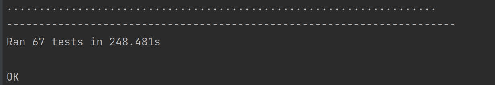

# Тестирование qdaqda.ru

ATTENTION <br>
По всему проекту периодически происходит такая штука, что страница может прогрузиться, а потом внезапно обновиться и сбросить все, что там было.
Возможно, где-то тут виноваты какие-то непредвиденные прорисовки из-за постоянного поллинга. 
Также возможно, что некоторые анимации работают не так гладко, как хотелось бы.
И implicit wait в таких случаях не особо спасает, так как элемент изначально уже присутствует на странице.
Было попробовано много чего, но в итоге только так.<br><br>
При регистрации новых аккаунтов сайт периодически падает, поэтому этот тест закомменчен.

#### Чтобы запустить тесты

* в одной вкладке
```
./grid.sh
```
* в другой вкладке
```
./node.sh
```
* наконец
```
BROWSER=CHROME|FIREFOX LOGIN= PASSWORD= NAME= ID= LOGIN2= PASSWORD2= NAME2= ID2= python3 ./run_tests.py
```
Проходит <s>часто</s>
